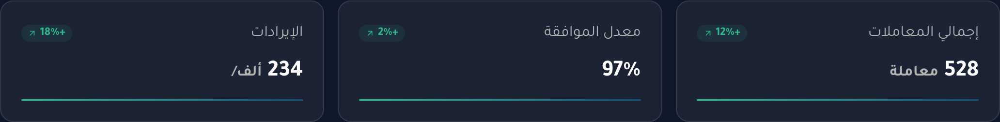
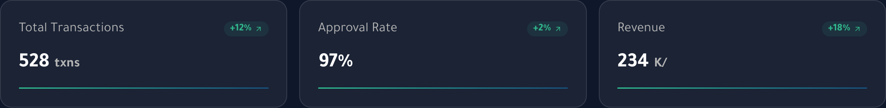

# Bug Report — Shari Landing Page

- **Environment:** Develop — https://develop.shari.sa/ (behind Cloudflare Access)
- **Tested:** 2026-08-26
- **Browser:** Chrome (desktop, 1280px viewport)
- **Locales checked:** Arabic (default) and English
- **Method:** Manual browser session; DOM/`localStorage` inspected via devtools console. Evidence in [`evidence/`](evidence/).

---

## BUG-01: Revenue stat shows a dangling slash with no currency or period

- Severity: Medium
- Location: "الأداء والتحليلات" / "Performance & Analytics" section — Revenue tile
- Preconditions: Landing page loaded
- Steps: Scroll to the analytics section and read the third stat tile ("الإيرادات" / "Revenue")
- Actual: Value renders as `234 ألف/` in Arabic and `234 K/` in English — the unit ends in a slash with nothing after it
- Expected: A complete unit, e.g. `234 ألف ر.س` (currency) or `234 ألف/شهر` (per period) — no trailing separator
- Reproducible: Yes, every load, both locales

**Evidence**

Arabic — `234 ألف/`:



English — `234 K/`:



The unit is a hardcoded string in the tile markup, which is why it reproduces in both locales rather than behaving like a missing translation:

```html
<p class="w-full text-start whitespace-nowrap">
  <span class="text-white text-[24px] font-bold leading-[32px]">234 </span>
  <span class="text-[#b4b4b4] text-base font-bold">ألف/</span>
</p>
```

---

## BUG-02: Language selection is not reflected in the URL

- Severity: Low — **[Flagged for PO]**
- Location: Header language toggle (English / العربية)
- Preconditions: Landing page loaded
- Steps: Switch the language, check the address bar, then copy the URL and open it in a different browser profile
- Actual: The URL stays `https://develop.shari.sa/` in both languages. The choice is stored client-side only, so it persists on reload for that browser but a shared link always opens in the default locale
- Expected: [Flagged for PO] Confirm whether each locale needs its own addressable URL, so a language can be deep-linked and shared, and so search engines can index both
- Reproducible: Yes

**Evidence** — console output after switching to English and back:

```js
location.href                      // "https://develop.shari.sa/"  (unchanged in both locales)
/\/(en|ar)(\/|$)/.test(location.pathname)   // false  — no locale path segment
new URLSearchParams(location.search).has('lang')  // false  — no locale query param
Object.entries(localStorage)       // [["shari-locale", "ar"]]
document.documentElement.lang      // "ar"  →  "en" after toggling
```

---

## BUG-03: Placeholder contact details and metrics are live on develop

- Severity: Low — **[Flagged for PO]**
- Location: Footer contact block; hero and social-proof stat rows
- Preconditions: Landing page loaded
- Steps: Read the footer phone number and the stat figures in the hero and "يثق بنا التجار" sections
- Actual: Footer phone is a placeholder pattern; hero metrics are implausibly low for a production claim
- Expected: [Flagged for PO] Confirm the real contact number and whether these figures are final. Tests should not assert against them until confirmed
- Reproducible: Yes

**Evidence** — console output:

```js
document.querySelector('a[href^="tel:"]').innerText        // "+966 11 000 0000"
document.querySelector('a[href^="tel:"]').getAttribute('href')  // "tel:+966110000000"
document.querySelector('a[href^="mailto:"]').getAttribute('href')  // "mailto:hello@shari.sa"

// Hero / social-proof stat tiles:
// "+500 معاملة ناجحة"
// "98% معدل الموافقة"
// "+10 تاجر نشط"
```

---

## Investigated and confirmed NOT defects

Recorded so these are not re-raised on the next pass.

| Checked | Result |
|---|---|
| Image `alt` attributes | **Correct.** 0 of 75 images are missing the attribute. 59 carry a deliberate `alt=""` (the right marking for decorative images, so screen readers skip them) and 16 have descriptive alt text. Verified with `document.images.filter(i => !i.hasAttribute('alt')).length` → `0`. |
| Testimonial names, footer links, solution bullets exposed to assistive tech | **Correct.** All present in the accessibility tree with proper roles — author names ("أحمد الشمري / مدير التجارة الإلكترونية"), the footer's Terms / Privacy / Security Awareness / Customer Protection links, and all four solution bullets. An earlier reading suggested these were missing; that was a truncated accessibility-tree dump, not a page fault. |
| Broken images | **None.** 0 of 75 images failed to load. |
| Language toggle behaviour | **Correct.** Flips `lang` and `dir` both ways (`ar`/`rtl` ↔ `en`/`ltr`); English translation coverage is complete — the only Arabic left on the EN page is the toggle's own label ("العربية"), which is correct; the choice persists across reload via `localStorage['shari-locale']`. |
| Layout stability | **Stable.** Sampled `scrollY`, `document.scrollHeight`, and element positions every 200 ms for 2 s — all constant, no layout shift. |
| Console errors (2) | **Environment, not the app.** Both are `/manifest.json` blocked by CORS from `axelerated.cloudflareaccess.com` — the Cloudflare Access gate in front of develop. Testers should not log these. |

## Not covered by this pass

`/register`, `/contact`, and the footer policy pages (terms, privacy, security awareness, customer protection) were not tested. Mobile and tablet viewports were not tested — desktop 1280px only.
